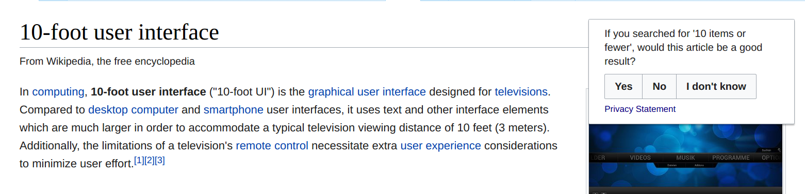

# Search Relevance: graded by humans (MVP)

Analysis of minimum viable product test of asking English Wikipedia visitors about the quality of certain pages for pre-specified search queries ([T171740](https://phabricator.wikimedia.org/T171740)).

**Queries**:

- 10 items or fewer
- block buster
- how do flowers bloom?
- sailor soldier tinker spy
- search engine
- star and stripes
- what is a genius iq?
- who is v for vendetta?
- why is a baby goat a kid?
- yesterday beetles

**Questions**:

- Would you click on this page when searching for '...'?
- If you searched for '...', would this article be a good result?
- If you searched for '...', would this article be relevant?
- If someone searched for '...', would they want to read this article?
